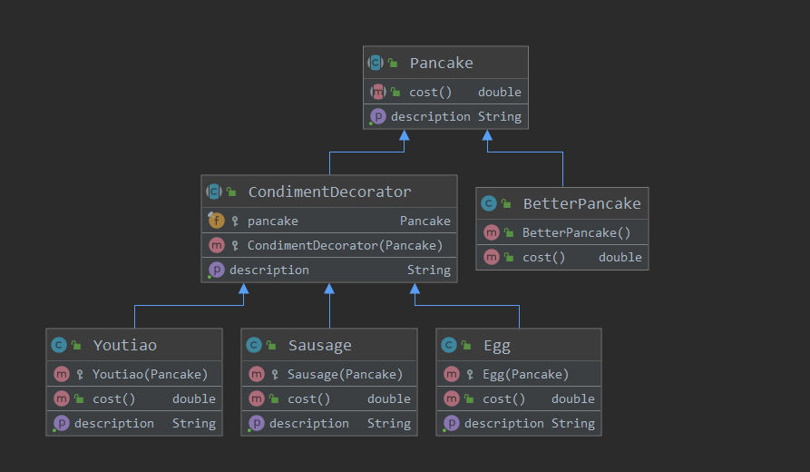

## 装饰器模式
### 角色
* Component：抽象组件，装饰者和被装饰者共同的父类，是一个接口或者抽象类，用来定义基本行为，可以给这些对象动态添加职责

* ConcreteComponent：具体的组件对象，实现类 ，即被装饰者，通常就是被装饰器装饰的原始对象，也就是可以给这个对象添加职责

* Decorator：所有装饰器的抽象父类，一般是抽象类，实现接口；它的属性必然有个指向 Conponent 抽象组件的对象 ，其实就是持有一个被装饰的对象

* ConcreteDecorator：具体的装饰对象，实现具体要被装饰对象添加的功能。每一个具体装饰类都定义了一些新的行为，它可以调用在抽象装饰类中定义的方法，并可以增加新的方法用以扩充对象的行为。

装饰者和被装饰者对象有相同的父类，因为装饰者和被装饰者必须是一样的类型，这里利用继承是为了达到类型匹配，而不是利用继承获得行为。
利用继承设计子类，只能在编译时静态决定，并且所有子类都会继承相同的行为；利用组合的做法扩展对象，就可以在运行时动态的进行扩展。装饰者模式遵循开放-关闭原则：类应该对扩展开放，对修改关闭。利用装饰者，我们可以实现新的装饰者增加新的行为而不用修改现有代码，而如果单纯依赖继承，每当需要新行为时，还得修改现有的代码。

### 类图

